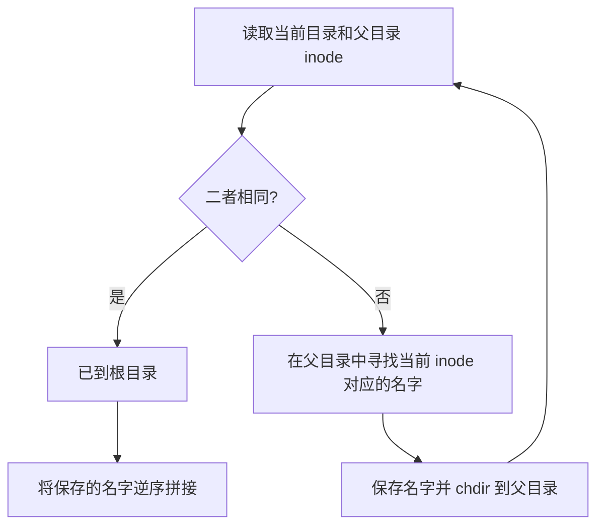

## task1.1
### 1.1.1 绝对路径

绝对路径从根目录 `/` 开始，完整描述一个位置，不依赖当前工作目录。

例如：

```text
/glimmer/glimmer_man/glimmer_woman/
```

无论当前位于 `/home`还是其他目录，它都指向同一个位置。

### 1.1.2 相对路径

相对路径不以 `/` 开头，从“当前工作目录”出发解释。
因此往往用到：

- `.`：当前目录
- `..`：父目录
- `../..`：连续向上两层

如：
现处于：
```text
/home/lin/workspace/
```

目标是：

```text
/var/backups/turing/
```

向上走的过程为：

```text
/home/lin/workspace  --..-->  /home/lin
/home/lin            --..-->  /home
/home                --..-->  /
```
综上来说
绝对路径如下
```test
cd /var/backups/turing/
```
相对路径如下
```test
cd ../../../var/backups/turing/
```
## task1.2
- `argc`：argument count，命令行参数的个数，**包含程序自身**。
- `argv`：argument vector，指针数组；每个元素指向一个以 `\0` 结尾的字符串。
- `argv[0]`：通常是启动程序时使用的名字或路径。
- `argv[argc]`：标准保证它是空指针 `NULL`。
题目中没有明确说明具体执行的指令(wtf)
如果执行：

```bash
./glimmer -a glimmer_man
```

通常看到：

```text
argc    = 3
argv[0] = "./glimmer"
argv[1] = "-a"
argv[2] = "glimmer_man"
argv[3] = NULL
```
注意：
- 每个名字用空格分隔
- 如用""的内容，引号内的空格不起分隔作用:"hello world"
  ## task 2
  ### task 2.1-非同寻常之物
  ~~所有的都常见--你们都豪不过我(bushi)~~

  常见的有
  - stdlib.h
  - stdio.h
  - string.h
  
  剩下的就很少见了 ~~(那就是罕见了)~~

  查询了一些资料关于这些 如下：

| 头文件 | 题中用到的内容 | 作用 |
|---|---|---|
| `<dirent.h>` | `DIR`、`struct dirent`、`opendir`、`readdir`、`closedir` | 输入输出、格式化字符串|
| `<sys/stat.h>` | `struct stat`、`stat`、`S_ISDIR` 等 | 读取文件元数据、判断文件类型 |
| `<sys/types.h>` | `mode_t`、`ino_t` 等类型 | POSIX 系统数据类型 |
| `<time.h>` | `localtime`、`strftime` | 把时间戳格式化成人类可读时间 |
其中
1. `<dirent.h>`：遍历目录

`<dirent.h>` 主要用于遍历目录，也就是查看一个文件夹里有哪些文件和子目录。

| 类型或函数 | 作用 |
| --- | --- |
| `DIR` | 表示目录流的类型，通常用 `DIR *` 指向已经打开的目录流。 |
| `struct dirent` | 保存一个目录项的信息，例如 `d_name` 保存名称，`d_ino` 保存 inode 编号。 |
| `opendir()` | 打开指定目录，返回 `DIR *`，供后续读取使用。 |
| `readdir()` | 每次读取一个目录项，返回指向 `struct dirent` 的指针；循环调用可以遍历目录。 |
| `closedir()` | 关闭目录流，释放相关资源。 |

 2. `<sys/stat.h>`：获取文件属性、修改权限

`<sys/stat.h>` 主要用于获取文件属性，也提供修改文件权限等功能。

| 结构体或函数 | 作用 |
| --- | --- |
| `struct stat` | 保存文件属性。例如 `st_mode` 保存文件类型和权限，`st_size` 对普通文件表示大小（字节数），`st_ino` 保存 inode 编号。 |
| `stat()` | 根据路径获取文件属性，写入 `struct stat`；遇到符号链接时，获取它指向的目标文件的属性。 |
| `lstat()` | 与 `stat()` 类似，但遇到符号链接时，获取链接本身的属性。 |
| `fstat()` | 根据已经打开的文件描述符获取文件属性。 |
| `chmod()` | 修改文件或目录的权限。 |
  
  ### task 2.2 看看权限

  思考:
  
  如果看二进制的话，就是看后九位，依次对应owner-group-other的rwx;
  其中:
  - 1对应字母(r-w-x)
  - 0对应'-'
  也因此引出八进制(因为1对应3的关系用八进制更可观)


   如果八进制看后三位，依次对应owner-group-other
 - 7对应111--对应owner的r-w-x;
 - 5对应101--对应group的r---x;
    
正确的代码:

```c
void parse_permissions(mode_t mode, char *perms) {
    const char rwx[] = {'r', 'w', 'x'};

    mode &= 0777;  

    for (int i = 0; i < 9; ++i) {
        mode_t mask = (mode_t)1 << (8 - i);
        perms[i] = (mode & mask) ? rwx[i % 3] : '-';
    }

    perms[9] = '\0';
}
```
另外一种(没有按照题目要求的const char rwx来写，借用了strcpy,也挺简洁的)

```c
void parse_permissions(mode_t mode, char *perms) {
  
  strcpy(perms,"rwxrwxrwx");
for(int i = 0;i <= 8;i++){

if((( mode >> i) & 1) == 0) perms[8 - i] = '-';

}

    perms[9] = '\0'; 
}
```
## task 3
### task 3.1 万物皆inode
**inode 可以理解为文件系统中的“对象档案”。常见内容包括**：

- 文件类型与权限 `mode`
- 所有者 UID、所属组 GID
- 文件大小
- 硬链接计数
- 访问时间 `atime`、内容修改时间 `mtime`、元数据修改时间 `ctime`
- 数据块位置或映射信息
- 其他文件系统相关元数据

创建时间 `birth time` 是否存在、能否读取，取决于文件系统和接口，不能把它当成所有 inode 都必有的传统字段。


**inode不保存的东西**:

- 不保存文件名
- 不保存完整路径
  
**'.'与'..'** :

 - `.` 指向当前目录本身。
- `..` 指向当前目录的父目录。
- 在根目录 `/` 中，根没有更高的父目录，所以 `.` 和 `..` 都指向根目录本身。
### task 3.2 寻我来时路
**代码思路** :


**可运行代码** :

**使用AI标注** :
- 思路是自己想的,把函数的主体写了出来，但在数据的存放与读取中存在了问题
- 刚开始我尝试用一维数据存放路线 不好打印 无果
- 后我告诉了AI我的情况(把原代码发给它后，说我在暑假的存放与打印出了问题，如果你是我你该用哪种思路解决)
- 之后AI告诉我先用二位数据存放，在把他放进一维数组里后打印的思路，我顺着这个思路完成了代码
- 又让AI给我补充了一些细节，如最大(MAX_NAME等)的设置，如opendir等函数返回失败时，path超过最大时应打印失败说明。

```c
#include <dirent.h>
#include <stdio.h>
#include <stdlib.h>
#include <string.h>
#include <sys/stat.h>
#include <sys/types.h>
#include <unistd.h>

#define MAX_DEPTH 256
#define MAX_NAME 256
#define MAX_PATH_TEXT 65536


ino_t get_inode(const char *path) {
    struct stat statbuf;
    if (stat(path, &statbuf) == -1) {
        perror("stat failed");
        exit(EXIT_FAILURE);
    }
    return statbuf.st_ino;
}
static void die(const char *message) {
    perror(message);
    exit(EXIT_FAILURE);
}


int main(void) {
    char names[MAX_DEPTH][MAX_NAME];
    int depth = 0;

    for (;;) {
        struct stat current;
        struct stat parent;

        current.st_ino = get_inode(".");
        parent.st_ino = get_inode("..");
        if (current.st_ino == parent.st_ino) break;
        if (depth == MAX_DEPTH) {
            fprintf(stderr, "directory nesting is too deep\n");
            return EXIT_FAILURE;
        }

        DIR *dir = opendir("..");
        if (dir == NULL) die("opendir ..");
        if (chdir("..") == -1) die("chdir ..");

        int found = 0;
        struct dirent *entry;
        while ((entry = readdir(dir)) != NULL) {
            if (strcmp(entry->d_name, ".") == 0 ||
                strcmp(entry->d_name, "..") == 0) {
                continue;
            }

            struct stat candidate;
           
             candidate.st_ino = get_inode(entry->d_name)

            if (candidate.st_ino == current.st_ino) {
                snprintf(names[depth], MAX_NAME, "%s", entry->d_name);
                ++depth;
                found = 1;
                break;
            }
        }
        closedir(dir);

        if (!found) {
            fprintf(stderr, "cannot find child entry in its parent\n");
            return EXIT_FAILURE;
        }
    }

    char path[MAX_PATH_TEXT];
    size_t used = 0;
    path[used++] = '/';
    path[used] = '\0';

    for (int i = depth - 1; i >= 0; --i) {
        size_t len = strlen(names[i]);
        if (used + len + 2 > sizeof path) {
            fprintf(stderr, "path is too long\n");
            return EXIT_FAILURE;
        }
        memcpy(path + used, names[i], len);
        used += len;
        if (i != 0) path[used++] = '/';
        path[used] = '\0';
    }

    puts(path);

    
    return 0;
}
    
```
## task 4 
### task 4.1 敢问 路在何方
**可运行代码**

```c
#include <stdio.h>
#include <string.h>
#include <dirent.h>
#include <sys/stat.h>
#include <unistd.h>


void find_file(const char *current_path, const char *target_name) {
    DIR *dir;
    struct dirent *entry;
    struct stat statbuf;

    if (!(dir = opendir(current_path))) {
        return; 
    }

    while ((entry = readdir(dir)) != NULL) {
        // 忽略当前目录 . 和父目录 .. 防止无限死循环
        if (strcmp(entry->d_name, ".") == 0 || strcmp(entry->d_name, "..") == 0) {
            continue;
        }

        char full_path[1024];
        snprintf(full_path, sizeof(full_path), "%s/%s", current_path, entry->d_name);

        if (stat(full_path, &statbuf) == -1) continue;

        if (strcmp(entry->d_name, target_name) == 0) {
        printf("%s\n", full_path);
        }

        if (S_ISDIR(statbuf.st_mode)) {
        find_file(full_path, target_name);
        }
     }
    closedir(dir);
}


    
